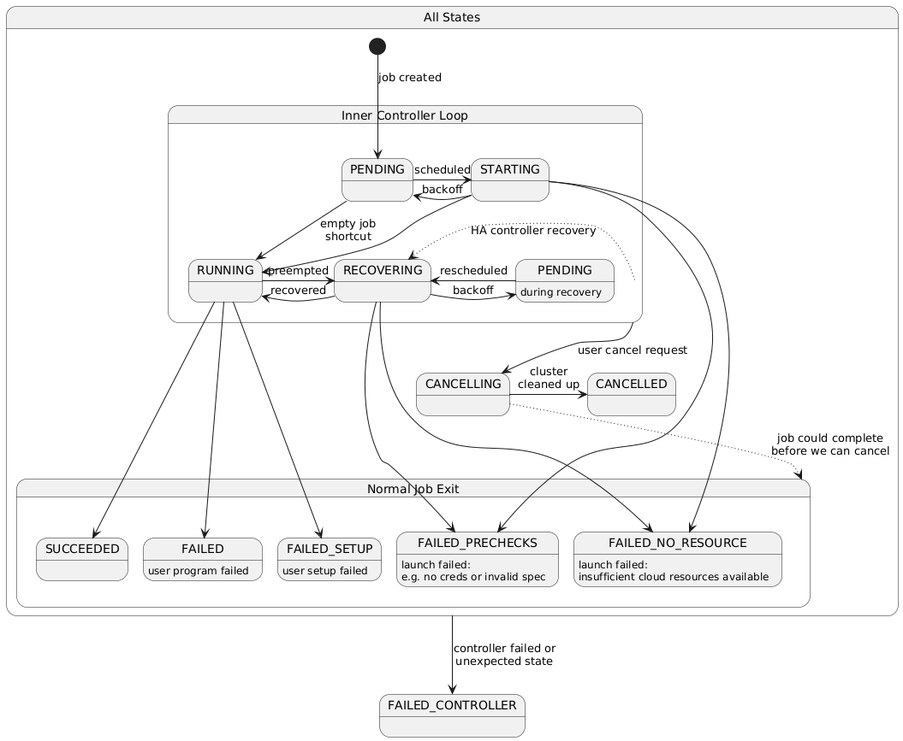
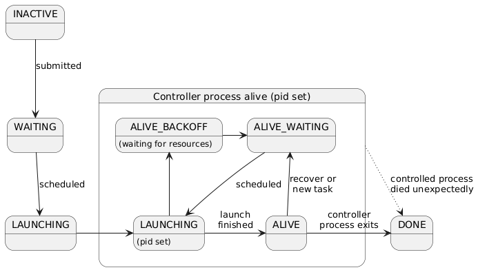

# SkyPilot Managed Jobs

This module is used for running and managing user jobs, which automatically recovers failed jobs from spot preemptions and/or machine failures.

## Concepts

- Task: A task (sky.Task) is a unit of work. SkyPilot will launch a cluster to run the task, automatically recover the task from preemptions, and terminate the cluster when the task is done.
- Job: A job in the context of SkyPilot managed jobs, is equivalent to a SkyPilot DAG (sky.Dag). A job is a collection of tasks that are executed in a specific order based on the dependencies between the tasks. Each controller process will be in charge of the whole lifecycle of a job.

Note that for singleton (1-task) jobs, we will use the term "task" and "job" interchangeably.

A job of n tasks (experimental; we support a pipeline of such tasks only): the job has its own job ID and name, and the tasks have their own task IDs (0, 1, ..., n-1) and names.

## Architecture

<!-- Raw file: https://docs.google.com/presentation/d/1AoFewsxm7jEsnFYyovyuTqKZs8W59qD9sNcM7Wcic4I/edit#slide=id.p -->

### State diagrams

There are two "state" notions for managed jobs:
- The managed job "status" reflects the user-facing status of the job.
- The "schedule state" is an internal-only state that is used by the scheduler to track controller processes and limit parallelism.

There is no consistent mapping between these two state notions. See comments/docstrings in sky/jobs/state.py.

Managed job status follows the following state diagram:

.
<!-- PlantUML source: (NOTE: remove the \ from "-\->". The \ is there to prevent exiting the HTML comment.)
@startuml

state "All States" as AllStates {
    state "Inner Controller Loop" as InnerLoop {
        PENDING -> SUBMITTED : controller\nproc. init
        SUBMITTED -> STARTING
        STARTING -\-> RUNNING : job started
        PENDING -\-> RUNNING : empty job shortcut
        RUNNING -> RECOVERING : preempted
        RECOVERING -left> RUNNING : recovered
    }

    [*] -\-> PENDING: job created

    state "Normal Job Exit" as Terminal {
        state FAILED_NO_RESOURCE : launch failed:\ninsufficient cloud resources available
        state FAILED_PRECHECKS : launch failed:\ne.g. no creds or invalid spec
        state SUCCEEDED
        state FAILED : user program failed
        state FAILED_SETUP : user setup failed
        STARTING -\-> FAILED_NO_RESOURCE
        RECOVERING -\-> FAILED_NO_RESOURCE
        STARTING -\-> FAILED_PRECHECKS
        RECOVERING -\-> FAILED_PRECHECKS
        RUNNING -\-> SUCCEEDED
        RUNNING -\-> FAILED
        RUNNING -\-> FAILED_SETUP
    }

    InnerLoop -\-> CANCELLING : user cancel request
    CANCELLING -> CANCELLED : cluster cleaned up
    CANCELLING -[dotted]-> Terminal: job could complete\nbefore we can cancel
}

AllStates -\-> FAILED_CONTROLLER : controller failed or\nunexpected state

@enduml
-->

Note that ANY status can legally transition to FAILED_CONTROLLER, even another terminal status. This is because we can have a controller failure or other problem after the job has already exited, e.g. when cleaning up the cluster.

The schedule_state follows a simpler diagram:

.
<!-- PlantUML source: (NOTE: remove the \ from "-\->". The \ is there to prevent exiting the HTML comment.)
@startuml

INACTIVE -\-> WAITING : submitted
WAITING -\-> LAUNCHING : scheduled

state "Controller process alive (pid set)" as ControllerProc {
    state "LAUNCHING" as LAUNCHING_PID : (pid set)
    state ALIVE_BACKOFF : (waiting for resources)
    LAUNCHING -> LAUNCHING_PID
    LAUNCHING_PID -> ALIVE : launch\nfinished
    LAUNCHING_PID -up-> ALIVE_BACKOFF
    ALIVE_BACKOFF -> ALIVE_WAITING
    ALIVE -up-> ALIVE_WAITING : recover or\nnew task
    ALIVE_WAITING -down-> LAUNCHING_PID : scheduled
}

ALIVE -> DONE : controller\nprocess exits
ControllerProc -[dotted]down-> DONE : controlled process\ndied unexpectedly

@enduml
-->
